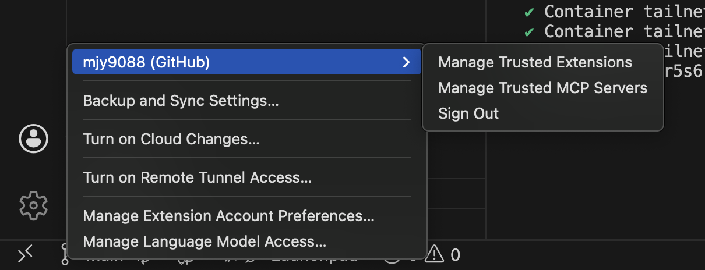

# Reproducible Docker Workstation Lab

[](https://github.com/mjy90884682/E1-1/actions/workflows/verify.yml)

터미널, Docker, Git 실습을 한 번 실행하고 끝내는 대신, 같은 결과를 다시 검증할 수
있는 개발 워크스테이션으로 구성한 프로젝트입니다. Docker-in-Docker(DinD)로
실습 환경을 격리하고, 각 요구사항을 실행 가능한 Bash 문서와 assertion으로
검증합니다.

## 실행 환경

2026-08-04 서울캠퍼스 지급 장비에서 다음 명령으로 확인했습니다.

```console
$ sw_vers
ProductName:            macOS
ProductVersion:         15.7.5

$ echo "$SHELL"; echo "$TERM_PROGRAM"
/bin/zsh
vscode

$ docker --version
Docker version 28.5.2, build ecc6942

$ docker compose version
Docker Compose version v2.40.3

$ git --version
git version 2.54.0
```

| 항목 | 실제 제출 환경 |
|---|---|
| 운영체제 | macOS 15.7.5 (Intel x86_64) |
| 쉘·터미널 | zsh, VS Code 통합 터미널 |
| 컨테이너 실행 환경 | OrbStack |
| Docker CLI / Engine | 28.5.2 / 28.5.2 |
| Docker Compose | 2.40.3 |
| Git | 2.54.0 |

자동 검증은 위 장비의 OrbStack에서 Alpine Linux 3.22 기반 DinD 컨테이너를
실행합니다. 이 컨테이너 안의 Bash 5.2.37, Docker 28.5.2, Git 2.49.1은
[`docker-compose.yml`](docker-compose.yml)에 버전과 이미지 digest를 고정했습니다.

## 요구사항과 증거

체크 표시는 실행 결과를 대신하지 않으므로 사용하지 않았습니다. 아래 각 행의
`구현·검증` 링크에서 명령을, `결과` 링크에서 제출 증거를 바로 확인할 수 있습니다.

| 요구사항 | 구현·검증 | 결과 |
|---|---|---|
| 터미널 이동·생성·복사·이름변경·삭제·내용 확인 | [`10-cli-and-permissions.bash`](scripts/10-cli-and-permissions.bash) | [실행 결과](#터미널과-권한) |
| 파일·디렉터리 권한 변경 전후 비교 | [`10-cli-and-permissions.bash`](scripts/10-cli-and-permissions.bash) | [실행 결과](#터미널과-권한) |
| Docker 설치·데몬·운영 명령 | [`20-environment-and-docker.bash`](scripts/20-environment-and-docker.bash) | [실행 결과](#docker-설치와-기본-운영) |
| hello-world와 Ubuntu, run/exec 차이 | [`20-environment-and-docker.bash`](scripts/20-environment-and-docker.bash) | [실행 결과](#docker-설치와-기본-운영) |
| Dockerfile 커스텀 이미지 | [`Dockerfile`](app/Dockerfile), [`index.html`](app/index.html), [`30-custom-image.bash`](scripts/30-custom-image.bash) | [빌드·실행 결과](#커스텀-nginx와-포트-매핑) |
| 포트 매핑과 접속 | [`30-custom-image.bash`](scripts/30-custom-image.bash) | [주소창 포함 화면](tests/expected/browser-with-address-bar.png) |
| 바인드 마운트 변경 반영 | [`40-storage.bash`](scripts/40-storage.bash) | [전후 결과](#바인드-마운트와-볼륨) |
| 볼륨 영속성 | [`40-storage.bash`](scripts/40-storage.bash) | [삭제 전후 결과](#바인드-마운트와-볼륨) |
| Git 설정과 GitHub 원격 저장소 | [`50-git.bash`](scripts/50-git.bash) | [검증 결과](#git과-github), [VS Code 로그인 화면](docs/submission/vscode-github-link.png) |
| 전체 재현 검증 | [`lab.bash`](lab.bash), [`verify.yml`](.github/workflows/verify.yml) | [GitHub Actions 실행 기록](https://github.com/mjy90884682/E1-1/actions/workflows/verify.yml) |

## 실행 방법

필수 도구는 OrbStack 또는 Docker Engine과 Docker Compose 플러그인입니다.

```bash
bash lab.bash up
bash lab.bash run
bash lab.bash down
```

전체 검증은 실패한 assertion에서 즉시 non-zero로 종료됩니다. 단계 하나만
살펴보려면 `bash lab.bash shell`로 들어가 원하는
[`scripts/`](scripts/) 파일을 실행합니다. `reset`은 실습 컨테이너, 이미지,
볼륨 데이터를 삭제하므로 확인 문자열을 입력해야만 동작합니다.

## 수행 로그

아래는 2026-08-04 `bash lab.bash run`의 핵심 출력입니다. 가변적인 컨테이너 ID,
CPU·메모리 수치와 긴 이미지 pull 출력은 생략했으며, 전체 명령은 각 실행 스크립트에
남겼습니다.

### 터미널과 권한

```console
$ pwd
/workspace
$ touch "$demo_dir/source/empty.txt"
$ cp "$demo_dir/source/note.txt" "$demo_dir/archive/copy.txt"
$ mv "$demo_dir/archive/copy.txt" "$demo_dir/archive/renamed.txt"
$ rm "$demo_dir/source/empty.txt"

$ chmod 600 "$demo_dir/source/note.txt"
$ stat -c '%A %a %n' "$demo_dir/source/note.txt"
-rw------- 600 .../source/note.txt
$ chmod 644 "$demo_dir/source/note.txt"
$ stat -c '%A %a %n' "$demo_dir/source/note.txt"
-rw-r--r-- 644 .../source/note.txt

$ chmod 700 "$demo_dir/archive"
drwx------ 700 .../archive
$ chmod 755 "$demo_dir/archive"
drwxr-xr-x 755 .../archive
```

### Docker 설치와 기본 운영

```console
$ docker --version
Docker version 28.5.2, build ecc6942
$ docker info
Server Version: 28.5.2
Storage Driver: overlay2
Operating System: Alpine Linux v3.22 (containerized)

$ docker run --name lab-hello hello-world:latest@sha256:...
Hello from Docker!
$ docker logs lab-hello
Hello from Docker!
$ docker images
REPOSITORY    TAG      IMAGE ID       SIZE
hello-world   <none>   e2ac70e7319a   10.1kB
$ docker ps -a
... Exited (0) ... lab-hello

$ docker run --name lab-ubuntu-once ubuntu:24.04@sha256:... \
    bash -lc 'echo "foreground process"; ls / | head'
foreground process
bin
boot
...
$ docker run -d --name lab-ubuntu ubuntu:24.04@sha256:... sleep infinity
$ docker exec lab-ubuntu bash -lc 'echo "exec process"; pwd'
exec process
/
$ docker stats --no-stream lab-ubuntu
CONTAINER ID   NAME         CPU %   MEM USAGE / LIMIT   ...
...            lab-ubuntu   0.00%   1.039MiB / 15.67GiB ...
```

첫 번째 Ubuntu 컨테이너는 주 프로세스가 끝나자 `exited`가 되었습니다. 두 번째는
`sleep infinity`가 PID 1로 계속 실행되므로 `docker exec` 프로세스가 끝난 뒤에도
`running`이었습니다. `attach`는 기존 주 프로세스의 입출력에 연결하고, `exec`는
실행 중인 컨테이너에 새 프로세스를 추가합니다.

### 커스텀 NGINX와 포트 매핑

공식 `nginx:1.27-alpine`을 베이스로 사용했습니다. OCI label은 이미지 용도를
식별하고, `COPY`는 기본 페이지를 과제 콘텐츠로 교체하며, `HEALTHCHECK`는 단순
프로세스 존재가 아닌 HTTP 응답 가능 상태를 판정합니다.

```console
$ docker build --tag workstation-web:1.0 /workspace/app
... naming to docker.io/library/workstation-web:1.0 done
$ docker run -d --name workstation-web -p 8080:80 workstation-web:1.0
$ docker ps --filter name=workstation-web
... Up ... (healthy)   0.0.0.0:8080->80/tcp   workstation-web
$ curl http://127.0.0.1:8080/
...<h1>It works reproducibly.</h1>...
$ docker logs workstation-web
... "GET / HTTP/1.1" 200 ...
```


이 화면은 [`60-browser-evidence.bash`](scripts/60-browser-evidence.bash)가 고정된
Chromium 이미지로 실제 `http://localhost:8080`에 접속해 생성하고, 저장소의
검토본과 byte-for-byte 비교합니다.

### 바인드 마운트와 볼륨

```console
$ docker run -d --name bind-web -p 8081:80 \
    --mount type=bind,source=/mnt/host-bind-mount-volume,\
target=/usr/share/nginx/html,readonly nginx:1.27-alpine@sha256:...
$ curl http://127.0.0.1:8081/
...<h1>It works reproducibly.</h1>...
$ printf '<h1>Changed through the host bind mount</h1>\n' > .../index.html
$ curl http://127.0.0.1:8081/
<h1>Changed through the host bind mount</h1>

$ docker volume create workstation-data
workstation-data
$ docker run -d --name volume-before \
    --mount type=volume,source=workstation-data,target=/data \
    ubuntu:24.04 sleep infinity
$ docker exec volume-before sh -c \
    'printf "persistent-data\n" > /data/result.txt'
$ docker exec volume-before cat /data/result.txt
persistent-data
$ docker rm -f volume-before
volume-before
$ docker run -d --name volume-after \
    --mount type=volume,source=workstation-data,target=/data \
    ubuntu:24.04 sleep infinity
$ docker exec volume-after cat /data/result.txt
persistent-data
```

바인드 마운트는 실제 macOS의 `volumes/bind-mount/`를 DinD 컨테이너를 거쳐
NGINX에 읽기 전용으로 연결합니다. named volume은 컨테이너를 삭제하고 새
컨테이너에 다시 연결한 뒤에도 `persistent-data`를 유지했습니다.

### Git과 GitHub

자동 검증에서는 개인정보가 아닌 `.invalid` 예시 계정을 격리된 컨테이너에
설정합니다. 실제 장비의 사용자 정보는 공개 문서에 출력하지 않았습니다.

```console
$ git config --global --get init.defaultBranch
main
$ git config --global --list
safe.directory=/workspace
user.name=workstation-student
user.email=student@example.invalid
init.defaultbranch=main
$ git remote -v
origin  https://github.com/mjy90884682/E1-1.git (fetch)
origin  https://github.com/mjy90884682/E1-1.git (push)
```



## 구조와 핵심 개념

```text
macOS + OrbStack
└── workstation (privileged DinD container)
    ├── /workspace                    # 이 저장소
    ├── /mnt/host-bind-mount-volume  # macOS bind mount 경로
    ├── Docker daemon                # 실습 전용 이미지·컨테이너·볼륨
    └── scripts/*.bash               # 명령, 출력 trace, assertion
        └── nested containers        # hello-world, Ubuntu, NGINX, Chromium
```

- **절대·상대 경로:** `/workspace/app/index.html`은 루트부터 시작하는 절대
  경로이고, 저장소 루트에서의 `app/index.html`은 현재 위치 기준 상대 경로입니다.
- **권한:** `r=4`, `w=2`, `x=1`을 소유자·그룹·기타 순서로 합산합니다.
  `755`는 `rwxr-xr-x`, `644`는 `rw-r--r--`입니다. 디렉터리의 `x`는 그
  디렉터리 안의 항목에 접근할 수 있다는 뜻입니다.
- **이미지·컨테이너:** 이미지는 불변 실행 템플릿이고, 컨테이너는 그 이미지에서
  생성한 격리된 실행 인스턴스입니다.
- **포트 매핑:** 컨테이너의 격리된 네트워크 포트를 장비에서 접근하려면
  `장비 포트:컨테이너 포트` 연결이 필요합니다.
- **바인드 마운트·볼륨:** 바인드 마운트는 지정한 장비 경로를 직접 연결해 변경을
  반영합니다. 볼륨은 Docker가 관리하며 데이터 수명을 컨테이너와 분리합니다.
- **Git·GitHub:** Git은 로컬 변경 이력을 관리하고, GitHub는 저장소 공유·리뷰·
  이슈 등 원격 협업 기능을 제공합니다.

## 트러블슈팅

### 1. 컨테이너 실행 직후 `curl: (56)` 발생

- 문제: NGINX 컨테이너가 실행 중인데 첫 HTTP 요청이 connection reset으로 실패
- 원인 가설: `docker run -d` 성공과 애플리케이션의 요청 가능 시점은 다름
- 확인: 실패 시점 health status는 `starting`, 잠시 후 같은 요청은 성공
- 해결: [`wait_for_http`, `wait_for_container_health`](scripts/lib.bash)로
  readiness를 확인한 뒤 응답 검증

### 2. DinD에서 Git `dubious ownership` 발생

- 문제: 컨테이너에서 `/workspace`의 `git status`가 거부됨
- 원인 가설: 프로세스 사용자는 root지만 bind-mounted 저장소는 macOS 사용자의 소유
- 확인: 컨테이너의 `id -u`와 `/workspace`의 소유자가 다름
- 해결: 모든 저장소를 허용하지 않고
  [`safe.directory=/workspace`](scripts/50-git.bash)만 지정

### 3. 동일 화면의 PNG hash가 간헐적으로 달라짐

- 문제: 눈으로 같은 주소창 캡처가 binary comparison에서 실패
- 원인 가설: 페이지가 아니라 Xvfb 또는 window manager의 동적 픽셀이 포함됨
- 확인: raw RGB 비교 결과 우측 경계 한 픽셀만 변동
- 해결: [`60-browser-evidence.bash`](scripts/60-browser-evidence.bash)에서 브라우저
  버전·viewport를 고정하고 동적인 창 경계와 clock panel을 캡처에서 제외

## 재현성과 보안

컨테이너 이미지는 tag뿐 아니라 digest까지 고정했고, GitHub Actions도 동일한
[`lab.bash`](lab.bash)를 실행합니다. 개인 장비 경로 대신 저장소 상대 경로와
컨테이너 내부의 고정 경로를 사용합니다. 토큰, 비밀번호, 개인키, 인증 코드는
수집하지 않으며 Git 예시 이메일은 예약 도메인 `.invalid`를 사용합니다.
