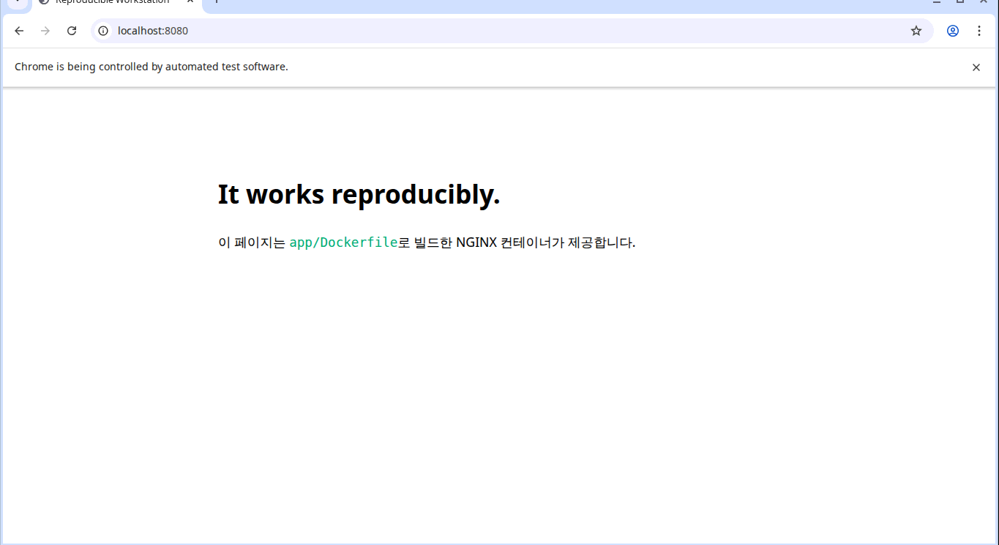

# Reproducible Docker Workstation Lab

[](https://github.com/mjy90884682/E1-1/actions/workflows/verify.yml)

Docker-in-Docker(DinD) 안에서 개발 워크스테이션 과제를 처음부터 끝까지 재현하는
실행형 문서입니다. 명령을 README에 복사해 나열하는 대신, 주석이 포함된 단계별
셸 스크립트를 단일 진실 공급원(single source of truth)으로 사용합니다.

> 단계별 Bash 파일 자체가 명령, 출력 조건, 실패 조건을 포함하는 실행형 기술
> 문서입니다. `bash lab.bash run`의 종료 코드가 전체 검증 결과입니다.

## 빠른 시작

필수 도구는 Docker Engine(또는 OrbStack)과 Docker Compose 플러그인뿐입니다.

```bash
bash lab.bash up
bash lab.bash run
bash lab.bash down
```

단계 하나만 다시 실행할 수도 있습니다.

```bash
bash lab.bash shell
# DinD 작업실 내부에서:
bash scripts/30-custom-image.bash
```

## 실행 환경

| 구분 | 검증 환경 |
|---|---|
| Host OS | Ubuntu 26.04 LTS |
| Host shell | Bash (`/bin/bash`) |
| Host terminal | CLI |
| Host Docker | 29.1.3 |
| Host Docker Compose | 2.40.3 |
| Reproducible OS | Alpine Linux 3.22 (outer DinD) |
| Reproducible shell | GNU Bash 5.2.37 |
| Reproducible Docker | Client/Server 28.5.2 |
| Reproducible Git | 2.49.1 |

## 설계

```text
host (Docker/OrbStack)
└── workstation (privileged DinD outer container)
    ├── /workspace              # 이 저장소
    ├── /mnt/host-bind-mount-volume # 실제 호스트 volumes/bind-mount/
    ├── Docker daemon           # 실습 이미지/컨테이너/볼륨
    ├── .local/evidence/        # ignored runtime output
    └── scripts/*.bash          # 실행 가능한 기술 문서
        └── nested containers   # hello-world, ubuntu, nginx, Chromium
```

DinD는 Git 설정, 권한 실습, 이미지, 컨테이너와 볼륨을 호스트 환경에서 격리합니다.
`lab.bash`가 실행 순서를 고정하고 각 단계는 결과가 다르면 즉시 non-zero로 종료합니다.

## 수행 체크리스트

- [x] 터미널 기본 조작 (`scripts/10-cli-and-permissions.bash`)
- [x] 파일·디렉터리 권한 변경 전후 비교 (`scripts/10-cli-and-permissions.bash`)
- [x] 실행 환경과 Docker 버전·데몬 점검 (`scripts/20-environment-and-docker.bash`)
- [x] 이미지/컨테이너/로그/stats 운영 명령 (`scripts/20-environment-and-docker.bash`)
- [x] hello-world 및 Ubuntu 컨테이너 실습 (`scripts/20-environment-and-docker.bash`)
- [x] 커스텀 NGINX 이미지 빌드·실행 (`scripts/30-custom-image.bash`)
- [x] 포트 매핑과 curl 검증 (`scripts/30-custom-image.bash`)
- [x] 실제 호스트를 관통하는 바인드 마운트 변경 반영 (`scripts/40-storage.bash`)
- [x] Docker 볼륨 영속성 (`scripts/40-storage.bash`)
- [x] Git 설정 검증 (`scripts/50-git.bash`)
- [x] 주소창 포함 Chromium binary regression (`scripts/60-browser-evidence.bash`)
- [ ] VS Code GitHub 로그인 화면(최종 제출 시 수동 확인)

## 커스텀 이미지

기존 베이스는 공식 `nginx:1.27-alpine` 이미지입니다. NGINX 설치 과정을 다시
작성하지 않고 검증된 웹 서버 실행 계약을 상속하기 위해 선택했습니다.

| 커스텀 포인트 | 목적 |
|---|---|
| OCI title/description label | 이미지 용도를 build 결과에서 식별 |
| `app/index.html` 복사 | 기본 환영 페이지를 과제 전용 콘텐츠로 교체 |
| HTTP healthcheck | 프로세스 존재가 아니라 실제 응답 가능 상태를 판정 |
| `8080:80` port mapping | 격리된 container port를 outer/host에 공개 |

## 핵심 개념

- **절대/상대 경로**: `/workspace/app/index.html`은 루트부터 시작하는 절대
  경로이고, 저장소 루트에서의 `app/index.html`은 현재 위치 기준 상대 경로입니다.
- **권한**: `r=4`, `w=2`, `x=1`의 합을 소유자/그룹/기타 순서로 씁니다.
  `755`는 `rwxr-xr-x`, `644`는 `rw-r--r--`입니다.
- **이미지/컨테이너**: 이미지는 불변 실행 템플릿이고 컨테이너는 그 이미지에서
  생성한 격리된 실행 인스턴스입니다.
- **포트 매핑**: 컨테이너 네트워크의 포트는 기본적으로 외부에서 직접 접근할 수
  없으므로 `호스트 포트:컨테이너 포트` 연결이 필요합니다.
- **바인드 마운트/볼륨**: 바인드 마운트는 지정한 파일 경로를 연결해 즉시 변경을
  반영하고, 볼륨은 Docker가 관리하며 컨테이너 수명과 데이터를 분리합니다.
- **Git/GitHub**: Git은 로컬 변경 이력을 관리하는 도구이고 GitHub는 저장소 공유,
  리뷰, 이슈 등 원격 협업을 제공하는 플랫폼입니다.

## UI 증거

Chromium `138.0.7204.183`을 고정한 Xvfb 환경에서 주소창을 포함한 창 전체를
캡처합니다. 브라우저 UI와 rasterization도 이미지의 일부이므로 버전과 캡처 입력을
고정하고 아래 검토본과 binary 비교합니다.



VS Code GitHub 로그인 화면은 최종 제출 전에 추가합니다.

## 트러블슈팅 기록

### 1. 컨테이너 실행 직후 `curl: (56)` 발생

- 문제: NGINX 컨테이너는 실행 중이지만 첫 HTTP 요청이 connection reset으로 실패
- 가설: `docker run -d` 성공과 애플리케이션의 요청 가능 시점은 다름
- 확인: 실패 시점의 health status가 `starting`이고 잠시 후 같은 요청은 성공
- 해결: `wait_for_http`와 `wait_for_container_health`로 readiness를 확인한 뒤 응답 검증

### 2. DinD에서 Git `dubious ownership` 발생

- 문제: outer container에서 `/workspace`의 `git status`가 거부됨
- 가설: 프로세스 사용자는 root지만 bind-mounted 저장소 소유자는 host UID임
- 확인: outer의 `id -u`와 `stat -c '%u' /workspace` 결과가 다름
- 해결: 모든 저장소를 허용하지 않고 `safe.directory=/workspace`만 지정

### 3. 동일 화면의 PNG hash가 간헐적으로 달라짐

- 문제: 눈으로 같은 주소창 캡처가 binary comparison에서 실패
- 가설: 페이지가 아니라 Xvfb 또는 window manager의 동적 픽셀이 포함됨
- 확인: PNG를 raw RGB로 디코딩해 비교한 결과 우측 경계 `(1359, 25)` 한 픽셀만 변동
- 해결: mouse cursor, 우측 7px window 경계와 하단 clock panel을 캡처에서 제외하고
  세 번의 독립 브라우저 세션에서 동일 SHA-256 확인
